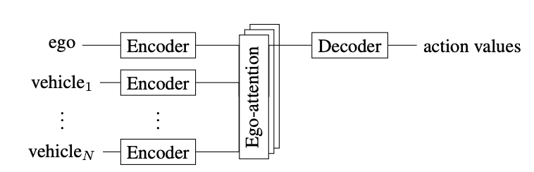
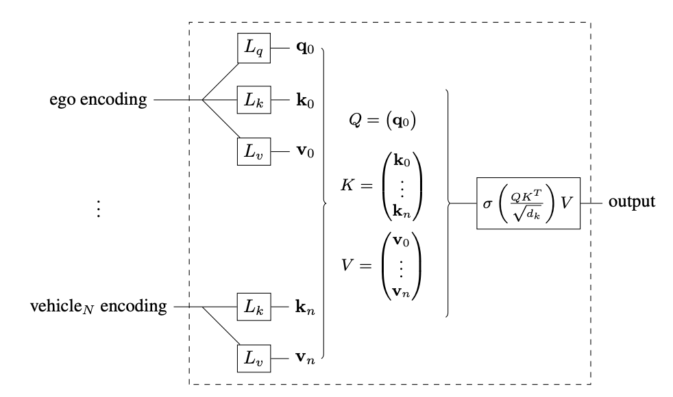

# Reinforcement Learning Interpretability

This Github repository consists of python notebooks and some utility python scripts that help run interpretability focused experiments on a trained DRL (deep reinforcement learning) agent.

## Motivation and Context:

I enrolled in AI safety fundamentals course hosted by Bluedot org. Details of the course are [here](https://aisafetyfundamentals.com/)

In these experiments, the agent in question is a DQN with Ego Attention architecture. Ego attention architecture was propsed by [Leurent et. al.](https://arxiv.org/abs/1911.12250)

Ego attention architecture consists of two embedding layers
1. Ego embedding - Ego embedding layer is dedicated to tracking features for vehicle driven by the agent itself.
2. Others embedding - Other embedding layer is dedicated to tracking features for vehicles driven by other agents.

### Embedding layers

### Attention layers

### Example of driving agent through the crossing

Here the agent successfully navigates through the crossing avoiding collision.
The verticle stripes on the right showcase the probabilities of 3 different actions taken by the agent. `SLOW, IDLE, FAST`

<video controls>
  <source src="./results/example_video.mp4" type="video/mp4">
</video>

## Purpose 
The hope of this project is to come up with some key insights and conclusions on the learned policies of the agent. To properly disect the agent's model and interpret what is happening inside it, I decided to borrow some common interpretability techniques from the literature.

### Observation techniques:
- Attention layer QK and OV circuits
- Study feature importance using captum
- Plot neuron activations and cosine similarities with embeddings
- Semantic dictionary interpretation
- Feature optimization
- Logit lens on attention mechanism
- Circuit analysis on actions

### Intervention:
- Model Editing and ablation
- Causal scrubbing and intervention

# Notebook:
[Notebook](src/highway/interpret_social_dqn.ipynb)
